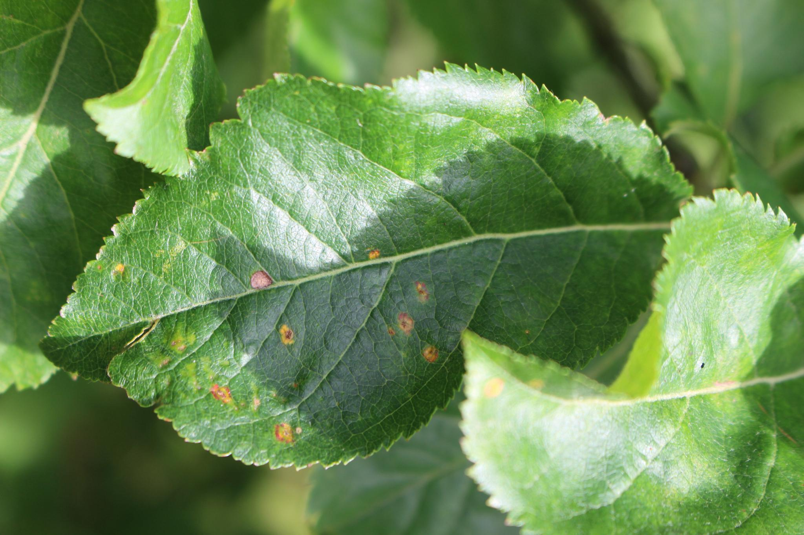
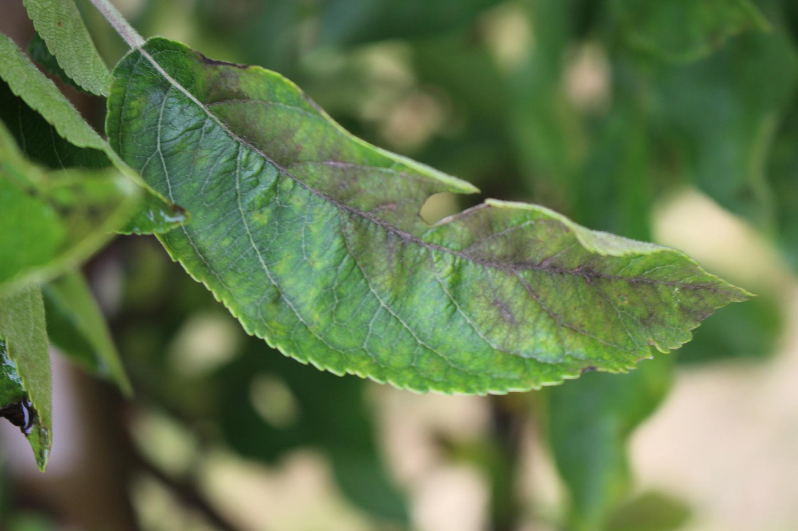
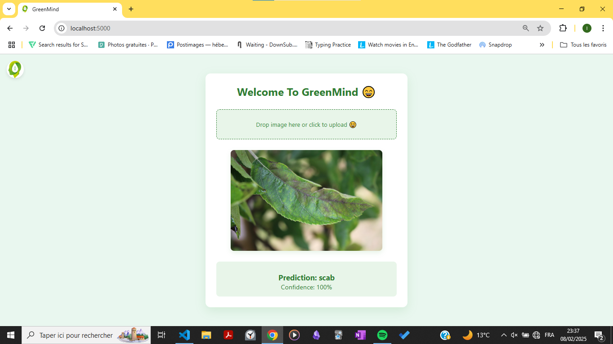
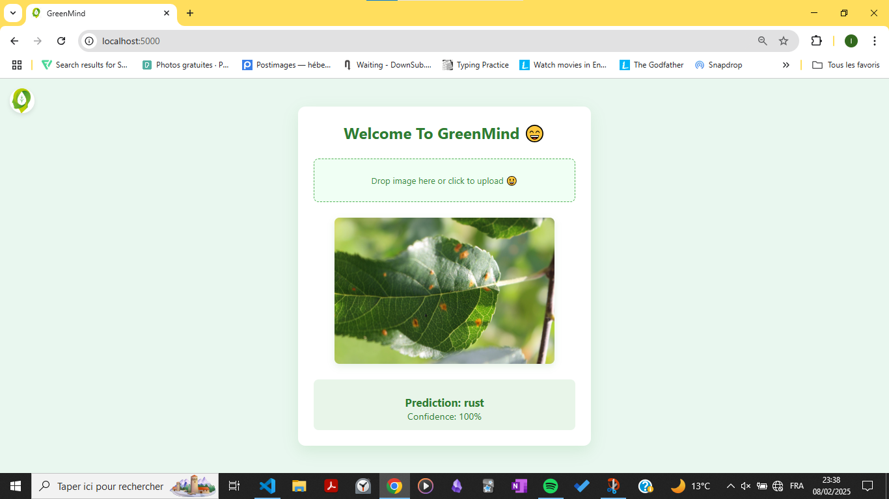

# GreenMind

<p align="center"> </p> 

# Aperçu du Projet

Ce projet vise à développer un outil automatisé pour la détection des maladies des plantes à partir d'images de feuilles. En tirant parti des avancées récentes dans les réseaux de neurones convolutifs (CNN), nous avons conçu un modèle capable de classer avec précision l'état de santé de diverses plantes.
<p align="center">
  
  
</p>

## Énoncé du Problème et Objectifs du Projet

La détection précoce des maladies des plantes est un défi majeur pour la sécurité alimentaire et la durabilité agricole. Les maladies foliaires, souvent identifiables par des lésions visibles ou des motifs atypiques, peuvent entraîner des pertes importantes de récoltes et des coûts élevés associés à l'utilisation excessive de pesticides.

Ce projet vise à développer un système d'apprentissage profond capable d'identifier avec précision divers types de maladies foliaires à partir d'images. L'objectif principal est d'optimiser la classification des maladies en utilisant trois architectures d'apprentissage profond pour déterminer le modèle le plus efficace et le plus adapté au problème donné.

Les objectifs spécifiques incluent :

- Classer avec précision quatre catégories principales : feuilles saines, tavelure, rouille et maladies multiples.
- Comparer les performances des modèles VGG-19, ResNet50 et EfficientNet B4 en termes de précision, robustesse et capacité de généralisation.
- Explorer les extensions potentielles avec des approches de segmentation à l'avenir pour analyser la distribution spatiale des infections.

## Données Utilisées

Le projet utilise un ensemble de données composé d'images de feuilles en haute résolution provenant du défi Plant Pathology 2020 - FGVC7 sur Kaggle. Ces images sont classées en quatre catégories distinctes :

- **Healthy** : Feuilles exemptes de toute maladie apparente.
- **Scab** : Feuilles présentant des lésions causées par la tavelure.
- **Rust** : Feuilles affectées par des taches brun-orange.
- **Multiple_diseases** : Présence de plusieurs maladies simultanément.


# Les Modèles Utilisés 


### **Random Forest (sans embedding)**  
Ce modèle utilise directement les pixels des images pour l'entraînement. Bien que simple et rapide, il n'arrive pas à capter les relations complexes dans les images, ce qui limite sa performance pour la classification des maladies des plantes.

### **Régression Logistique (sans embedding)**  
Ce modèle linéaire est rapide et facile à entraîner, mais il n'est pas efficace pour la classification d'images, avec des performances médiocres dans ce cas. Il ne parvient pas à saisir la complexité des informations visuelles liées aux maladies des plantes.

### **Random Forest avec Embeddings EfficientNet B4**  
Ici, les embeddings extraits par EfficientNet B4 sont utilisés comme caractéristiques d'entrée pour le modèle. Ce processus permet de mieux capturer les relations complexes dans les images, offrant ainsi des performances supérieures pour la classification des maladies des plantes.

### **VGG-19**  
VGG-19 est un modèle de réseau neuronal convolutif profond, utilisé pour l'extraction de caractéristiques visuelles complexes. Dans ce projet, il permet d'identifier des motifs dans les images des feuilles pour classifier les maladies, bien qu'il soit un peu moins performant que d'autres modèles comme ResNet50 et EfficientNet B4.

### **ResNet50**  
Ce modèle utilise des connexions résiduelles pour résoudre le problème de disparition du gradient et améliorer l'entraînement. Dans le cadre de ce projet, il est très performant pour détecter les maladies des plantes grâce à sa capacité à extraire des caractéristiques profondes des images.

### **EfficientNet B4**  
EfficientNet B4 est un modèle optimisé pour offrir un bon compromis entre précision et efficacité. Grâce à sa capacité à extraire des caractéristiques visuelles complexes tout en étant plus rapide à entraîner, il est idéal pour la classification des maladies des plantes avec une haute précision.


# Comparaison entre modèles


| Modèle                                      | Précision (Entraînement) | Précision (Validation) | Avantages                                         | Inconvénients                                   |
|---------------------------------------------|--------------------------|------------------------|--------------------------------------------------|-------------------------------------------------|
| **Random Forest (sans embedding)**         | -                        | 67%                    | Facile à entraîner et à implémenter              | Ne capture pas les relations complexes dans les images |
| **Régression Logistique (sans embedding)** | -                        | 57%                    | Très simple et rapide à entraîner                | Très mauvaise performance avec des images       |
| **Random Forest avec Embeddings EfficientNet B4** | -                    | 87.69%                 | Meilleure capture des caractéristiques complexes | Complexité supplémentaire et besoin d'extraction d'embeddings |
| **VGG-19**                                  | 73.52%                   | 67.61%                 | Facile à utiliser, bonne performance sur des tâches classiques | Performance modérée pour des tâches complexes   |
| **ResNet50**                                | 97.90%                   | 93.75%                 | Très bonne gestion des gradients, haute précision | Plus lourd à entraîner et nécessitant des ressources élevées |
| **EfficientNet B4**                         | 100%                     | 95.74%                 | Très efficace et précis, excellent compromis entre performance et ressources | Nécessite beaucoup de ressources et de temps de calcul |


##  Installation et Déploiement  

### 1. Cloner le Répertoire  
```bash
git clone https://github.com/ibrahimelhariri/GreenMind.git
```
### 2. Télécharger le Modèle
Dans le répertoire flask-ml-app/models, vous trouverez un fichier model_link.txt.
Ce fichier contient un lien pour télécharger le modèle. Assurez-vous de placer le fichier téléchargé dans le dossier models.
### 3. Construire l'Image Docker
Ouvrez PowerShell ou un terminal et placez-vous à la racine du projet :
```bash
cd GreenMind

docker build -t dl-flask-app .
```
### 4. Lancer le Conteneur
Exécutez la commande suivante pour lancer l'application :
bash
CopierModifier
```bash
docker run -d -p 5000:5000 --name my-flask-app \
-v "C:/path/to/your/uploads:/app/flask-ml-app/static/uploads" dl-flask-app
```
#### Remarque : 
Remplacez C:/path/to/your/uploads par le chemin de votre choix pour l'enregistrement des images à tester.
### 5. Démarrer le Conteneur
Si le conteneur est arrêté, vous pouvez le redémarrer avec :
```bash
docker start my-flask-app
```

##  Test de l'Application
1. Ajoutez les images que vous souhaitez tester dans le répertoire spécifié précédemment (C:/path/to/your/uploads).
2. Accédez à l'application via http://localhost:5000 sur votre navigateur.


### example d’interface


 <p align="center">
  
  


</p>

## Remarque !!!!

Si vous avez besoin des details de projet vous pouvez consultez la Notebook  si joint

